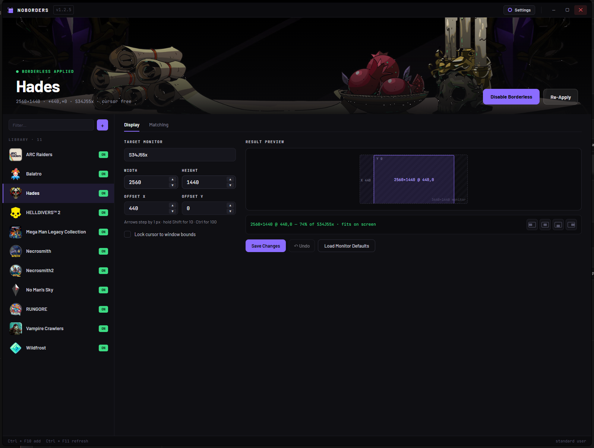
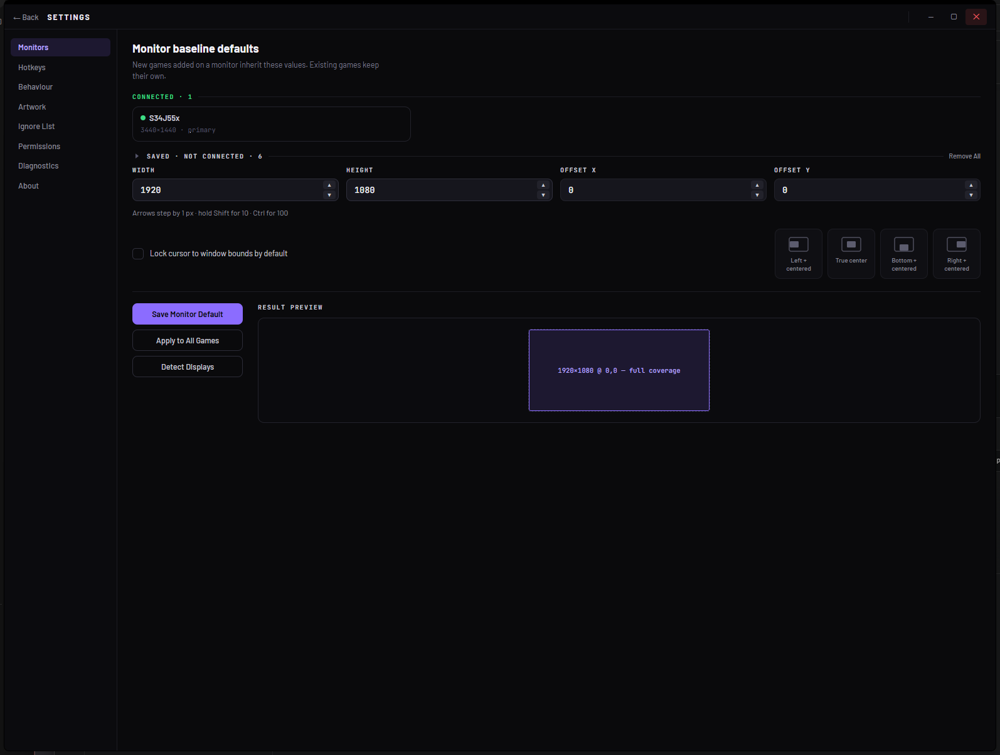
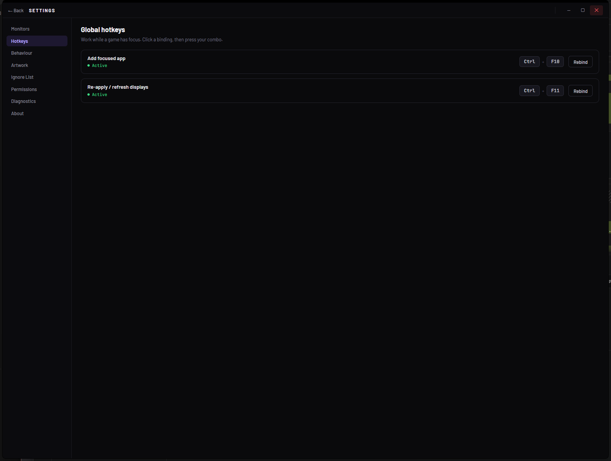
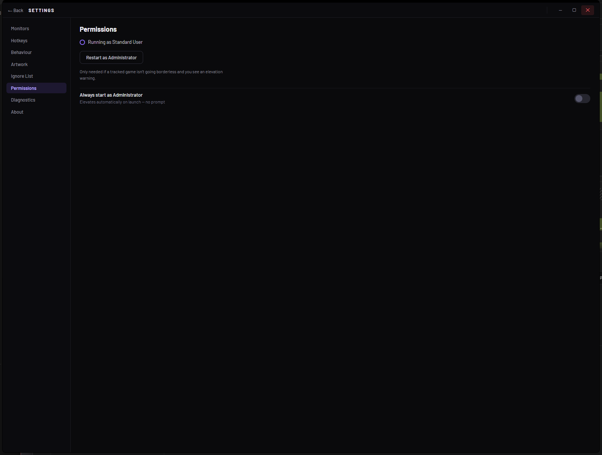
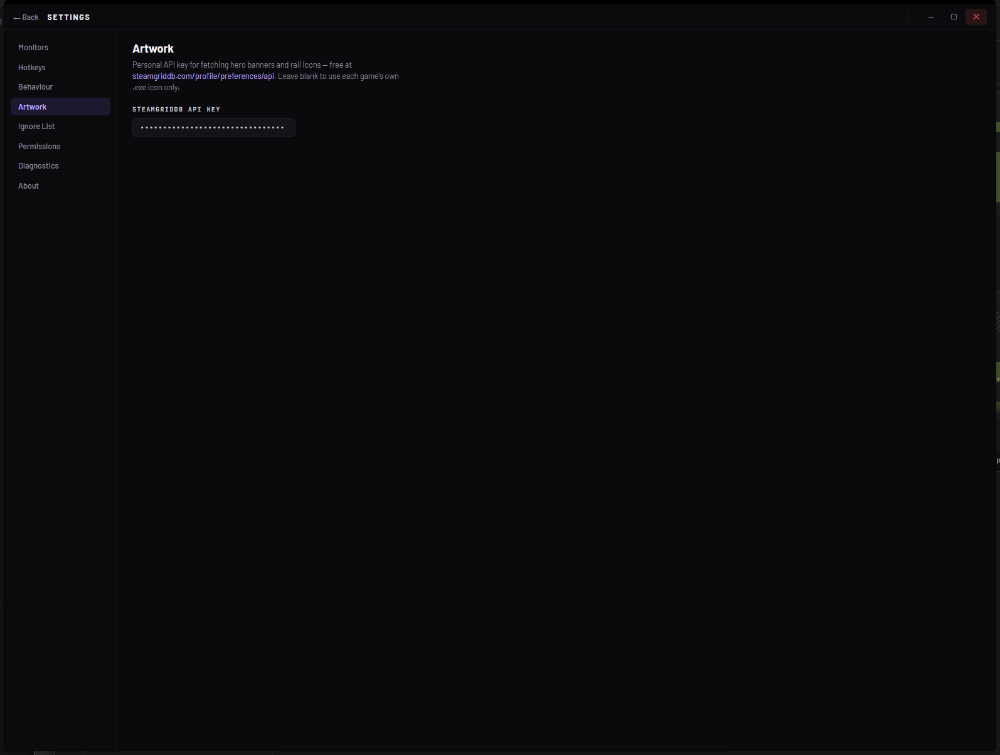
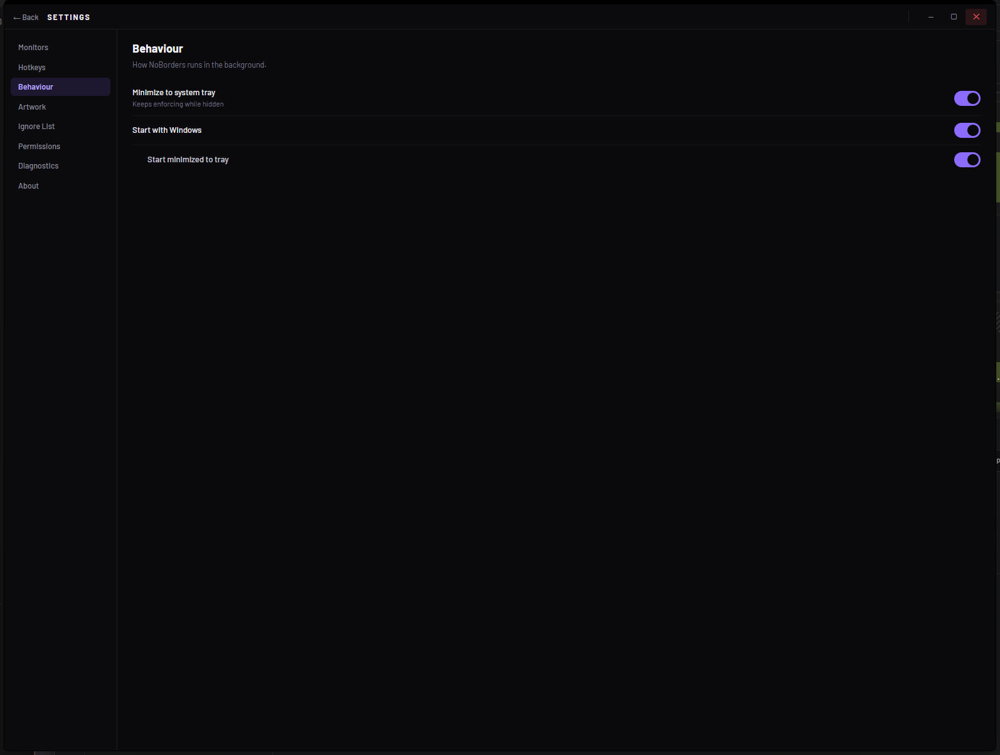
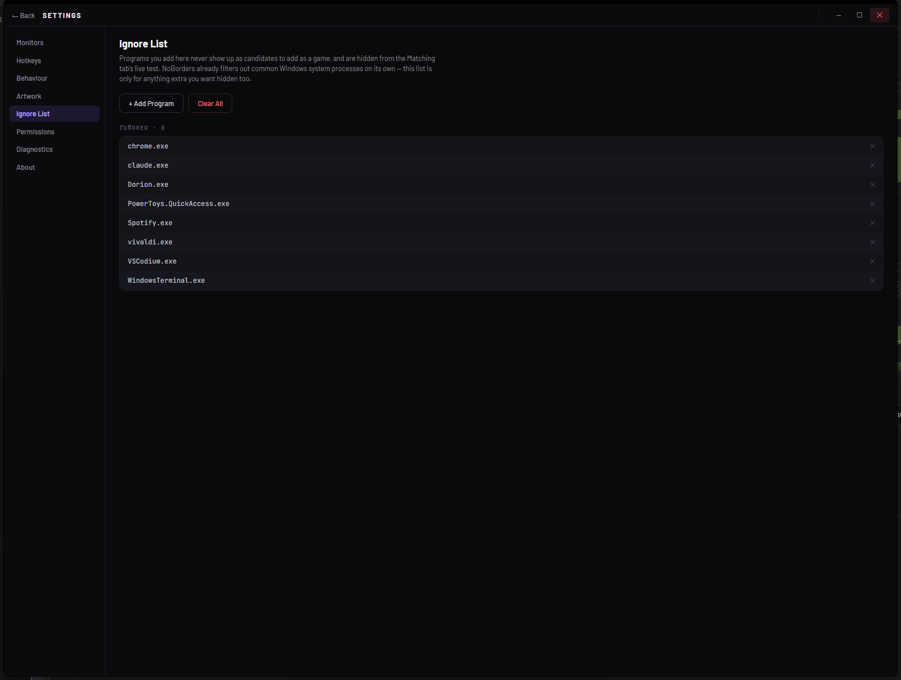
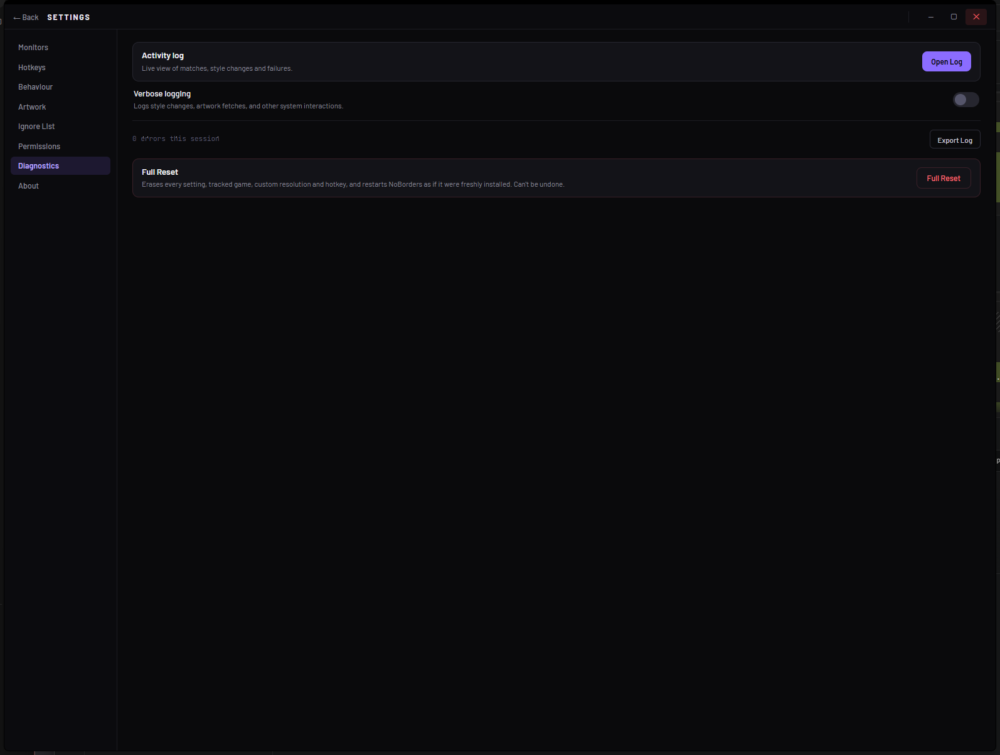
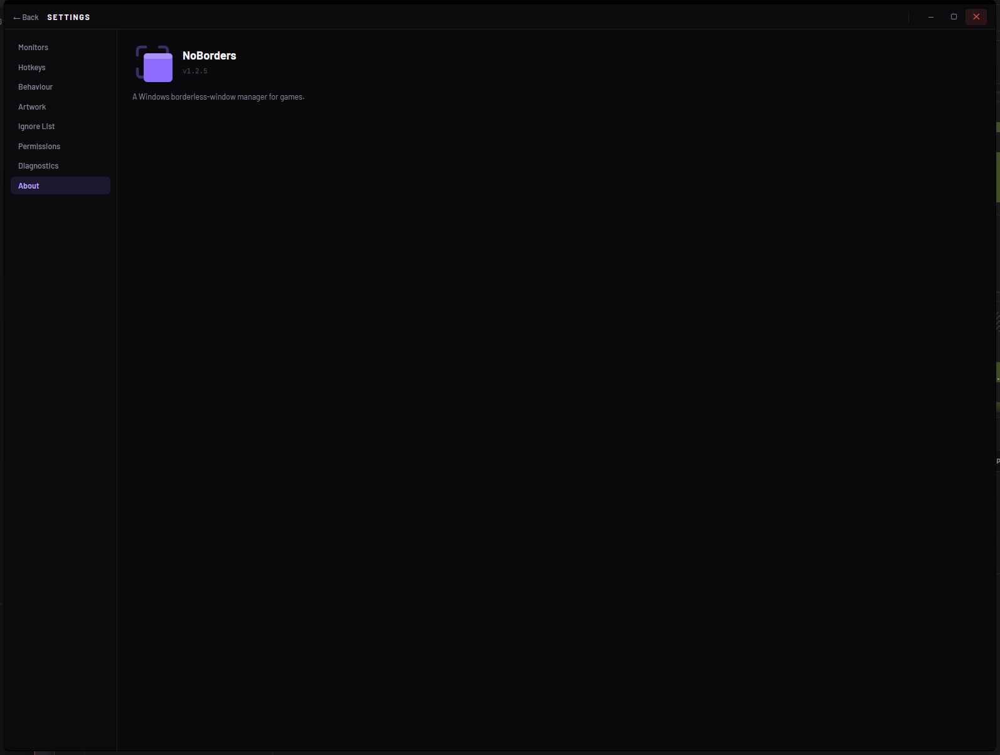

  

<h1 align="center">NoBorders</h1>

A Windows borderless-window manager for games.

<strong>v1.2.5</strong> · Windows 10/11 (x64) · portable, no installer

---

## Overview

NoBorders strips the title bar and borders off a game window and positions it
exactly where you want — full screen on a specific monitor, offset onto part
of an ultrawide, centered in a corner, whatever your setup needs. It runs
quietly in the system tray, keeps enforcing your chosen layout for as long as
the game is open (including re-correcting it if the game resets its own
window on a menu/cutscene), and reapplies the same profile automatically the
next time you launch that game.

It's aimed at games that don't offer a real borderless-fullscreen option, or
whose own version doesn't behave on multi-monitor/ultrawide setups — pick the
window once, and NoBorders remembers it by process name or window title from
then on.

Ships as a single self-contained `.exe` — copy it anywhere and run it, no
install step.

## Screenshots

**Games — Display**: per-game, per-monitor size & position, with a live
coverage preview.

**Settings — Monitors**: per-monitor baseline defaults new games inherit,
including monitors that aren't currently connected.

**Settings — Hotkeys**: rebindable global hotkeys with live registration
status.

More settings pages

| | |
|---|---|
|  |  |
|  |  |
|  |  |

## Features

**Games — Display**
- Per-game, per-monitor profiles: target monitor, width/height, offset X/Y,
  with live result preview (coverage % and "fits on screen" check).
- Steppers for all four values (±1, Shift ±10, Ctrl ±100), plus one-click
  align buttons (left/center/bottom/right-centered).
- "Lock cursor to window bounds" — confines the mouse to the game window,
  applied the instant you toggle it.
- Enable/Disable Borderless and Re-Apply, right from the hero panel.
- Load Monitor Defaults pulls that monitor's saved baseline onto the game.
- Save Changes / single-level Undo, shared with the Matching tab.

**Games — Matching**
- Match a game by process name or window title (regex), with a live test
  panel showing which of your currently open windows match.
- Editable display name (with "fetch from running window"), executable path,
  and per-game artwork.

**Monitors (Settings)**
- Baseline width/height/offset/lock-cursor defaults per monitor, inherited
  by newly-added games.
- Remembers monitors that are currently disconnected (last-known
  resolution), separate from the connected list.
- "Apply to All Games" pushes a monitor's baseline onto every existing game
  at once; "Detect Displays" re-scans.

**Hotkeys**
- Two global hotkeys (default `Ctrl+F10` add-focused-app, `Ctrl+F11`
  re-apply/refresh), rebindable by pressing a new combo, with live
  active/disabled/conflict status.

**Artwork**
- Optional personal SteamGridDB API key for hero banners/icons; falls back
  to the game's own `.exe` icon if left blank.
- Picker auto-applies on an unambiguous match, otherwise lets you choose
  from candidates.

**Permissions**
- One-click "Restart as Administrator" (needed for some anti-cheat-protected
  games) and an "Always start as Administrator" toggle.
- In-app elevation prompt when a tracked game needs admin rights NoBorders
  doesn't currently have.

**Ignore List**
- Hide specific processes from every "add game" picker and the Matching
  live-test, on top of built-in system-process filtering.

**Behaviour**
- Minimize to tray (keeps enforcing while hidden), start with Windows, start
  minimized.

**Diagnostics**
- Live Activity Log (filter by Info/Warn/Error, free-text search,
  pause/auto-scroll, per-entry detail with Copy/Restart-as-Admin).
- Verbose logging toggle, session error counter, and a "Full Reset" that
  wipes every setting and restarts fresh (confirmation-gated).

**Tray icon**
- Theme-adaptive mono icon, dims when enforcement is paused.
- Right-click menu shows your tracked games with a live borderless-status
  dot, plus Pause/Resume Enforcement.

## Known Bugs / Limitations

- **Export Log button does nothing** — present in Settings → Diagnostics but
  not wired up yet.
- **Toast "Undo" isn't functional** — the toast component supports an Undo
  link, but nothing currently triggers it (the Display/Matching tabs' own
  ↶ Undo button works fine; this is the separate toast-level one).
- **Target Monitor dropdown is a plain native `<select>`**, not the custom
  popup from the original design mock — a cosmetic gap only.
- **Hotkey "Listening…" capture has no live modifier-chip feedback** (e.g.
  Ctrl/Shift lighting up as held) — shows a static "Listening…" placeholder
  while waiting for a combo.
- **Settings and the Activity Log are in-app panels, not separate OS
  windows** — by design for now, but noted as a possible future change.
- **WebView2 rendering has historically been fragile around sleep/wake and
  minimized startup** (fixed across v1.1.0, v1.1.1, v1.2.1 for three
  distinct trigger paths) — no open issue currently, but worth
  regression-watching if a blank/grey window ever reappears.
- Light theme isn't available — NoBorders is dark-only.

## Todo / Roadmap

- [ ] Wire up Settings → Diagnostics → Export Log.
- [ ] Either remove the unused toast-level Undo affordance or give it a real
      snapshot/restore to call.
- [ ] Custom-styled Target Monitor dropdown, matching the rest of the UI.
- [ ] Live modifier-key feedback in the hotkey capture UI.
- [ ] Evaluate making Settings/Activity Log real separate windows instead of
      in-app panels.
- [ ] Add a LICENSE file.
- [ ] CI build/release pipeline (currently built and versioned by hand; see
      the post-commit hook that rebuilds `bin/Release/.../publish/` on a
      version bump).

## Requirements

- Windows 10/11, 64-bit.
- Administrator rights only needed for games protected by anti-cheat that
  blocks un-elevated window changes — NoBorders prompts for this itself when
  it detects the mismatch.

## Installation

No installer — download `NoBorders.exe`, put it anywhere, run it. All
settings live under `%LOCALAPPDATA%\NoBorders`.

## Quick Start

1. Launch a game, then press **Ctrl+F10** (or click **+** in the Games list)
   to add its window.
2. On the **Display** tab, pick a target monitor and set width/height/offset,
   or use an align button for one-click centering/edge placement.
3. Toggle **Enable Borderless** — NoBorders keeps enforcing that layout for
   as long as the game runs, including across restarts.

See [CHANGELOG.md](CHANGELOG.md) for release history.
